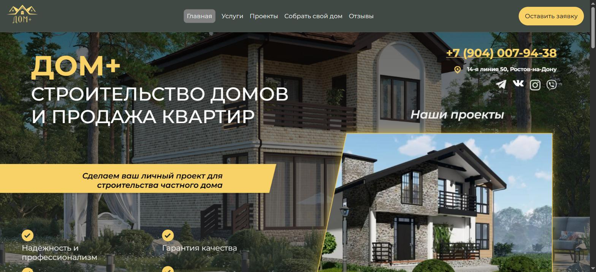
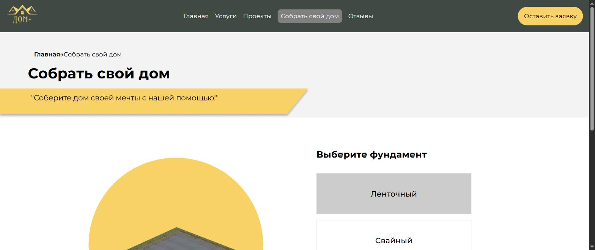
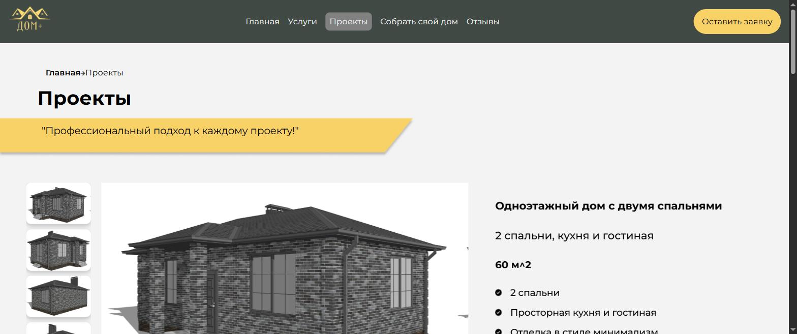
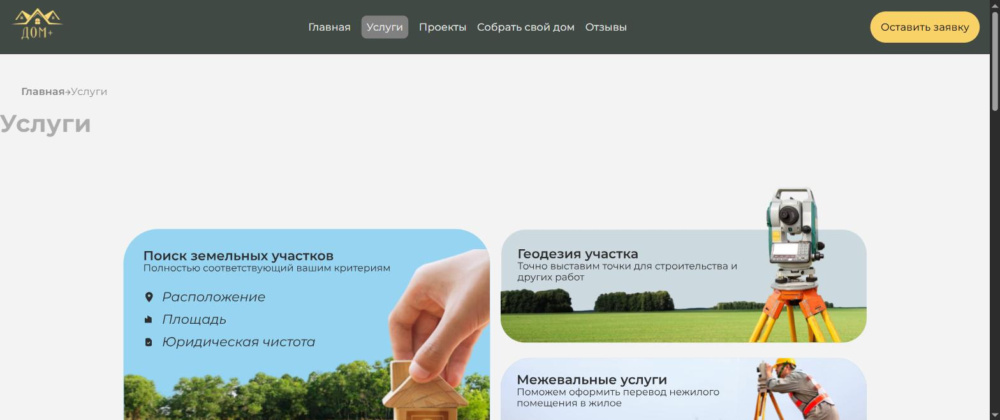
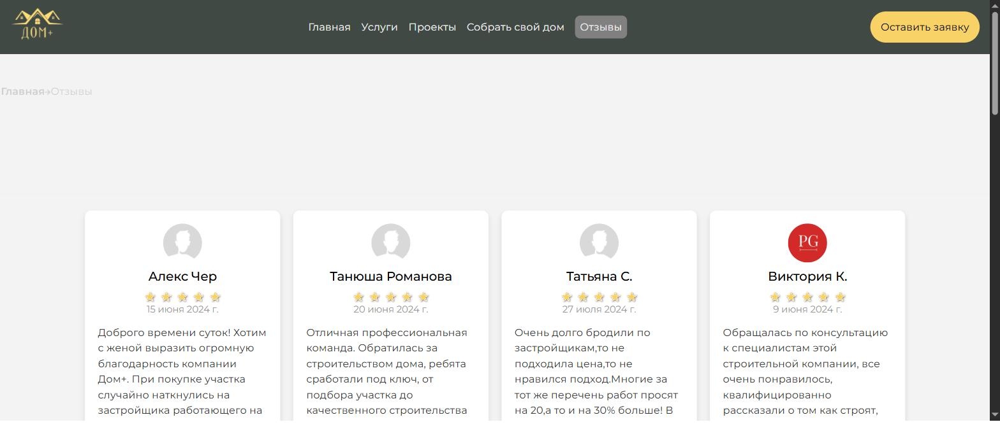

# ДОМ+ — сайт строительной компании

Промо-сайт и лид-генерация для компании полного цикла строительства частных домов (Ростов-на-Дону): каталог готовых проектов, интерактивный конструктор дома, услуги, отзывы и приём заявок с интеграцией в amoCRM.



## Возможности

- **Каталог проектов домов** — 9+ типовых проектов (60–140 м²) с планировками, характеристиками и слайдером изображений
- **Интерактивный конструктор дома** — пошаговый визуальный выбор фундамента, стен, наружной/внутренней отделки и крыши с анимациями (Framer Motion), результат собирается в заявку
- **Кредитный калькулятор** — расчёт условий ипотеки/рассрочки прямо на странице проекта
- **Каталог услуг** — геодезия, межевание, подбор участка и сопровождение сделки
- **Отзывы клиентов** — карточки с рейтингом и датами
- **Формы захвата лидов** — единый виджет заявки на всех страницах, отправка через Axios в API, откуда лид попадает в amoCRM (`@mobilon-dev/amotop`)
- **Карта на главной** — Яндекс.Карты (`@pbe/react-yandex-maps`) с адресом офиса
- **Адаптивная навигация** — единый Header/Footer, автоскролл вверх при переходах, ссылки на соцсети (VK, Telegram, WhatsApp, Instagram)

## Скриншоты

| Конструктор дома                                  | Каталог проектов                               |
| -------------------------------------------------- | ----------------------------------------------- |
|   |       |

| Услуги                                       | Отзывы                                     |
| ---------------------------------------------- | --------------------------------------------- |
|       |       |

## Технологии

- **React 18** + **TypeScript**, сборка на **Vite**
- **React Router** — клиентская маршрутизация (`/`, `/services`, `/projects`, `/reviews`, `/constructor`)
- **Framer Motion** — анимации конструктора и попапов
- **Axios** — отправка заявок в API (`REACT_APP_API_BASE_URL`)
- **Swiper** / **react-slick** — слайдеры проектов и главной страницы
- **@pbe/react-yandex-maps** — карта офиса
- **@mobilon-dev/amotop** — интеграция лидов с amoCRM
- **ESLint** — линтинг проекта

## Структура проекта

```
src/
├── components/
│   ├── MainPage/        # Главная: Header, Hero, Feedback, карта, футер
│   ├── Constructor/      # Пошаговый конструктор дома с анимациями
│   ├── Projects/         # Каталог проектов, кредитный калькулятор
│   ├── ServicesPage/      # Каталог услуг
│   └── Reviews/           # Страница отзывов
├── widgets/
│   └── Form/              # Универсальная форма заявки (лид в CRM)
└── assets/                 # Изображения, иконки, анимации конструктора
```

## Запуск проекта

```bash
npm install

# Указать адрес API в .env
echo "REACT_APP_API_BASE_URL=https://api.example.com" > .env

npm run dev       # локальный запуск (Vite)
npm run build     # production-сборка
npm run preview   # предпросмотр сборки
npm run lint       # проверка кода
```

## Автор

[Владимир Петросян](https://github.com/VladimirPetrosyan)
